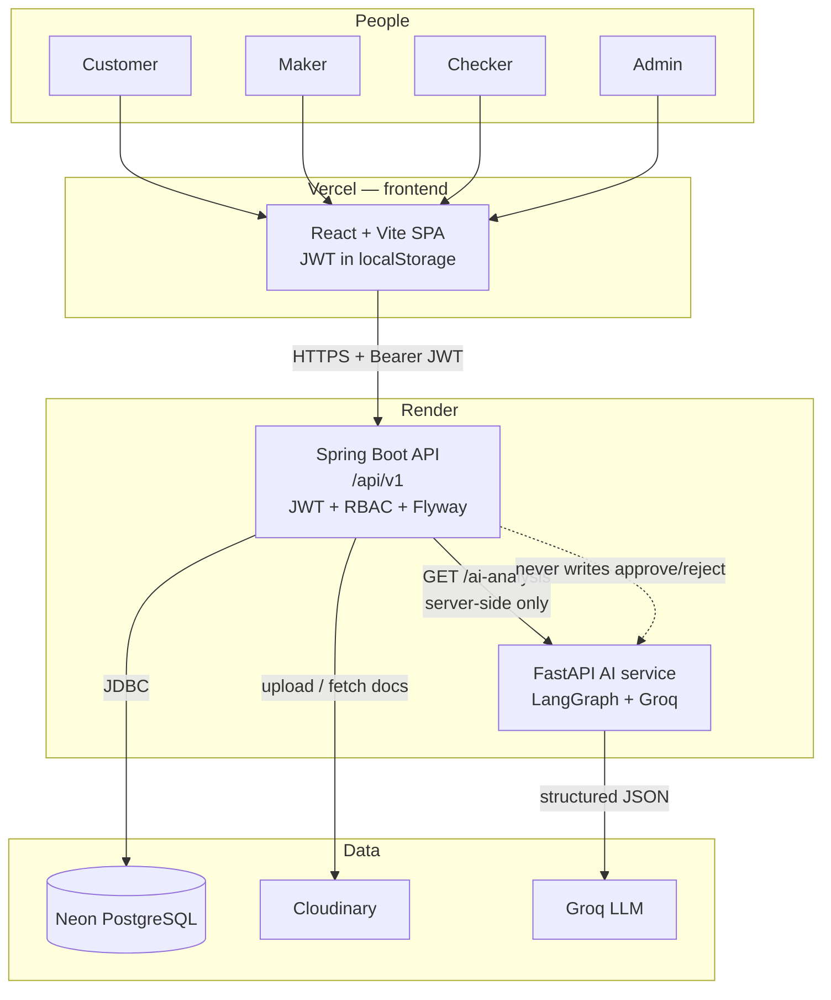

# LoanPro

Maker-checker loan processing: apply, verify documents, then a checker approves or rejects. AI is advisory only — it never decides.

**Stack:** React + Vite · Spring Boot 4.1 · PostgreSQL · FastAPI + LangGraph + Groq

## Architecture

LoanPro is three services plus two managed stores. The SPA never talks to the AI service or the database. Spring Boot is the only authority for auth, workflow, and the final approve/reject decision.




### AI analysis pipeline (advisory only)

Triggered by `GET /api/v1/applications/{id}/ai-analysis` (`MAKER` / `CHECKER` / `ADMIN`). EMI and DTI are computed in Python, not by the model. Invalid LLM JSON retries once, then a deterministic fallback. Disclaimer is always attached: a human must decide.


| Agent | Output used by makers/checkers |
| --- | --- |
| **document_agent** | Completeness, missing types, mismatches |
| **eligibility_agent** | Amount/tenure vs product; EMI/DTI metrics |
| **risk_agent** | Risk level + manual checks |
| **verification_summary_agent** | Short briefing; never approve/reject |

## Run locally

Copy `.env.example` → `.env` (Neon/Cloudinary). Copy `ai-service/.env.example` → `ai-service/.env` (`GROQ_API_KEY`).

```bash
docker compose up -d postgres mailhog

cd backend && ./mvnw spring-boot:run          # http://localhost:8080
cd frontend && npm install && npm run dev     # http://localhost:5173
cd ai-service && python3.12 -m venv .venv && source .venv/bin/activate
pip install -r requirements.txt
uvicorn app.main:app --reload --host 127.0.0.1 --port 8000
```

Or: `docker compose --profile app up --build` → UI at http://localhost:8081

## Demo

| Role | Email | Password |
| --- | --- | --- |
| Customer | customer@loanpro.com | Customer@12345 |
| Maker | maker@loanpro.com | Maker@12345 |
| Checker | checker@loanpro.com | Checker@12345 |
| Admin | admin@loanpro.com | Admin@12345 |

Flow: Customer submits → Maker claims and verifies → Send to checker → Checker decides. AI is a briefing only.

## Deploy

**Backend → [Render](https://render.com)** (Web Service, Docker, root `backend`)

Health: `/actuator/health`

Env:
```
DATABASE_URL=jdbc:postgresql://...neon.tech/neondb?sslmode=require
DATABASE_USERNAME=
DATABASE_PASSWORD=
JWT_SECRET=                           # 32+ random chars
CORS_ORIGINS=https://YOUR-APP.vercel.app
STORAGE_TYPE=cloudinary
CLOUDINARY_CLOUD_NAME=
CLOUDINARY_API_KEY=
CLOUDINARY_API_SECRET=
CLOUDINARY_FOLDER=loanpro
```

**Frontend → [Vercel](https://vercel.com)** (Import GitHub, root `frontend`)

Env:
```
VITE_API_URL=https://YOUR-API.onrender.com/api/v1
```

Redeploy frontend after setting `VITE_API_URL`. Then set `CORS_ORIGINS` on Render to the Vercel URL and restart the API.

Demo logins stay the same if `APP_SEED_ENABLED` is true (default).

